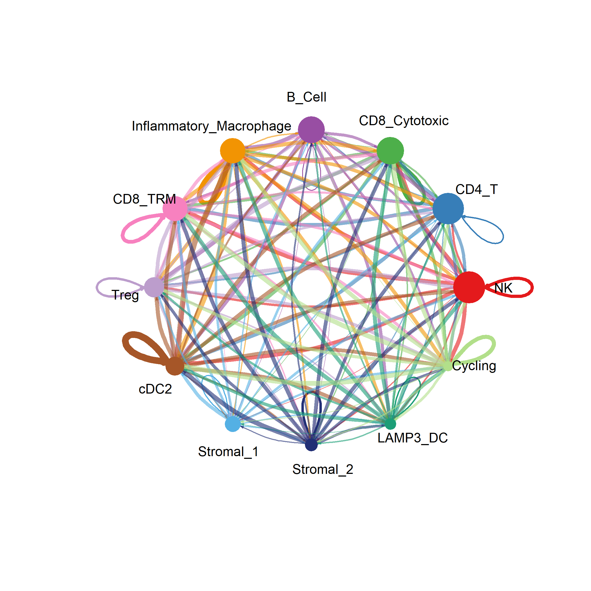
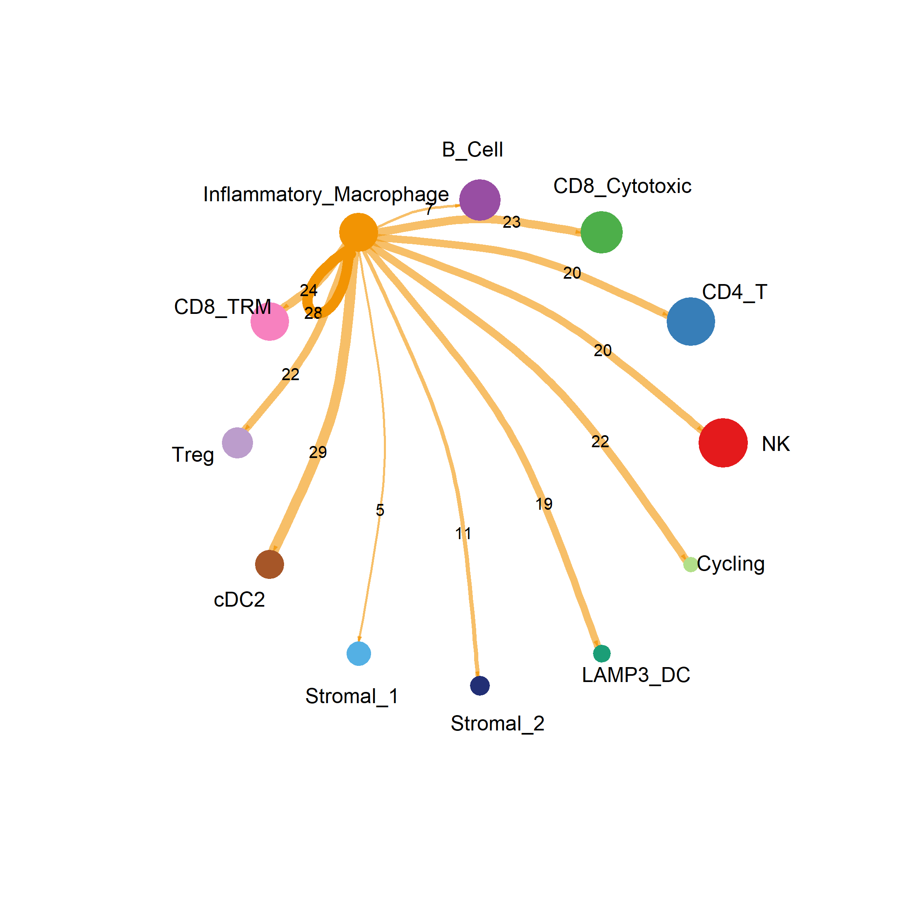
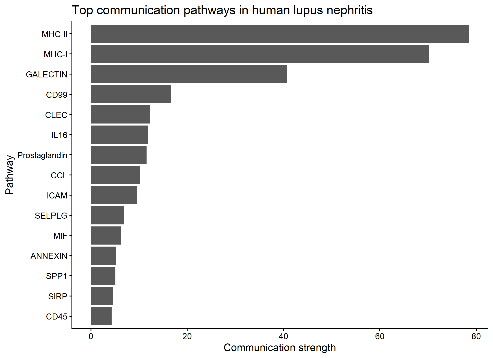

<p align="center">
  
</p>

<h1 align="center">
Cell–Cell Communication Analysis of Inflammatory Macrophage Signaling in Lupus Nephritis
</h1>

<p align="center">


</p>

---

# Overview

This project presents a systems immunology analysis of intercellular communication networks in human lupus nephritis using single-cell RNA sequencing and the CellChat framework.

Rather than studying immune cells independently, this workflow reconstructs the signaling interactions occurring between immune and stromal cell populations within the kidney microenvironment.

The objective is to identify communication hubs, dominant signaling pathways, and macrophage-derived communication programs that may contribute to disease progression and represent potential therapeutic opportunities.

---

# Scientific Motivation

Lupus nephritis is characterized by complex interactions between infiltrating immune cells and resident kidney cells.

Traditional single-cell analyses identify cellular composition but do not explain how these cells communicate.

This project addresses this challenge by integrating:

- Single-cell transcriptomics
- Ligand–receptor interaction inference
- Network biology
- Pathway-level communication analysis
- Systems immunology

to reconstruct the communication landscape of the lupus nephritis kidney.

---

# Workflow

```text
Human Single-cell RNA Sequencing
             │
             ▼
Quality-controlled Seurat Object
             │
             ▼
Cell Type Annotation
             │
             ▼
CellChat Ligand-Receptor Inference
             │
             ▼
Global Communication Network
             │
             ▼
Macrophage-centered Signaling Analysis
             │
             ▼
Pathway Prioritization
             │
             ▼
Biological Interpretation
```

---

# Repository Structure

```text
scripts/
│
├── 01_setup_cellchat.R
└── 02_cellchat_human_amp_ln.R

figures/

results/

docs/

data/
    README.md
```

---

# Dataset

Human kidney single-cell RNA sequencing

**AMP Lupus Nephritis Consortium**

ImmPort Study:

**SDY997**

Dataset summary:

- 2,838 kidney cells
- 22,709 genes
- 12 annotated immune and stromal populations

The processed Seurat object is intentionally excluded because of GitHub size limitations.

Instructions for downloading the original public dataset are provided in the **data/** folder.

---

# Computational Pipeline

The workflow includes:

- Quality control
- Cell type annotation
- CellChat communication inference
- Ligand–receptor interaction analysis
- Global communication network reconstruction
- Pathway-specific communication analysis
- Macrophage-centered signaling analysis

This systems-level strategy identifies communication programs that cannot be detected through differential expression analysis alone.

---

# Main Results

The pipeline generated:

- Global communication network
- Incoming and outgoing signaling analysis
- Macrophage interaction tables
- Pathway-specific communication networks
- Communication strength ranking
- Therapeutic pathway prioritization

---

# Key Biological Findings

## Inflammatory macrophages function as major communication hubs

Inflammatory macrophages participated in hundreds of significant ligand–receptor interactions and communicated extensively with:

- CD4 T cells
- CD8 cytotoxic T cells
- Regulatory T cells
- B cells
- Dendritic cells
- Stromal cells

This suggests that macrophages coordinate multiple aspects of the inflammatory microenvironment.

---

## Dominant communication pathways

The strongest signaling pathways identified included:

| Rank | Pathway |
|------|----------|
| 1 | MHC-II |
| 2 | MHC-I |
| 3 | GALECTIN |
| 4 | CD99 |
| 5 | CLEC |
| 6 | IL16 |
| 7 | PROSTAGLANDIN |
| 8 | CCL |
| 9 | ICAM |
| 10 | MIF |

These pathways highlight coordinated antigen presentation, leukocyte recruitment, and innate immune activation in lupus nephritis.

---

## Macrophage-derived signaling programs

Representative communication programs included:

- TNF → TNFRSF1A/B
- CCL3 / CCL4 → CCR5
- BAFF signaling toward B cells
- Galectin-9 signaling across multiple immune populations

These findings suggest inflammatory macrophages act as central organizers of immune communication within the kidney.

---

# Translational Relevance

Several communication pathways identified in this analysis are directly relevant to therapeutic development.

For example:

- BAFF signaling is targeted clinically by **Belimumab**
- CCL signaling represents an important regulator of leukocyte recruitment
- Galectin signaling may represent an underexplored therapeutic opportunity
- TNF-related signaling remains an important inflammatory axis

These results illustrate how computational systems biology can prioritize biologically meaningful signaling programs for future investigation.

---

# Example Figures

## Global Communication Network

<p align="center">

</p>

---

## Macrophage Communication Network

<p align="center">

</p>

---

## Major Signaling Pathways

<p align="center">

</p>

---

# Technologies

- R
- Seurat
- CellChat
- ggplot2
- dplyr
- patchwork
- Single-cell RNA sequencing
- Network Biology
- Systems Immunology
- Computational Immunology

---

# Future Directions

Planned extensions include:

- Cell-cell communication comparison across patient subtypes
- Integration with spatial transcriptomics
- Ligand activity prediction
- Network centrality analysis
- AI-assisted pathway prioritization
- Multi-omic communication modeling

---

# Reproducibility

The analysis is fully reproducible.

Run the scripts in order:

```
01_setup_cellchat.R

↓

02_cellchat_human_amp_ln.R
```

All intermediate communication tables and publication-quality figures are generated automatically.

---

# Related Projects

This repository is part of the **AI Computational Immunology Portfolio**.

- Cross-Species Therapeutic Target Discovery in Lupus Nephritis
- Cell–Cell Communication Analysis of Inflammatory Macrophage Signaling
- AI-Driven Therapeutic Target Prioritization
- AI-Driven Patient Stratification and Precision Targeting

Together these projects demonstrate an end-to-end computational workflow progressing from **single-cell biology** to **AI-assisted precision medicine**.

---

# Author

Independent computational biology and AI project focused on:

- Systems Immunology
- Translational Immunology
- Autoimmune Disease
- Single-cell Transcriptomics
- Network Biology
- Machine Learning
- Precision Medicine
