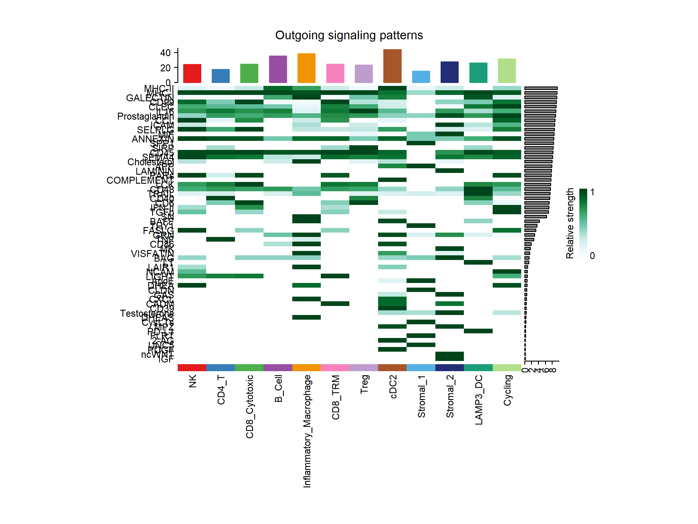
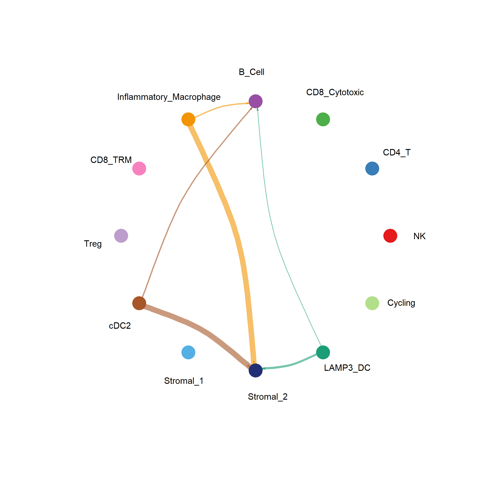
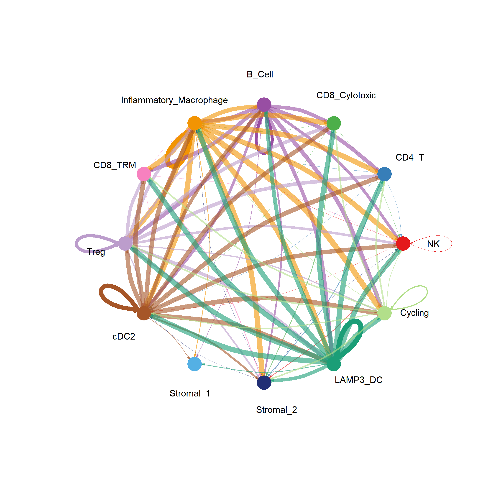
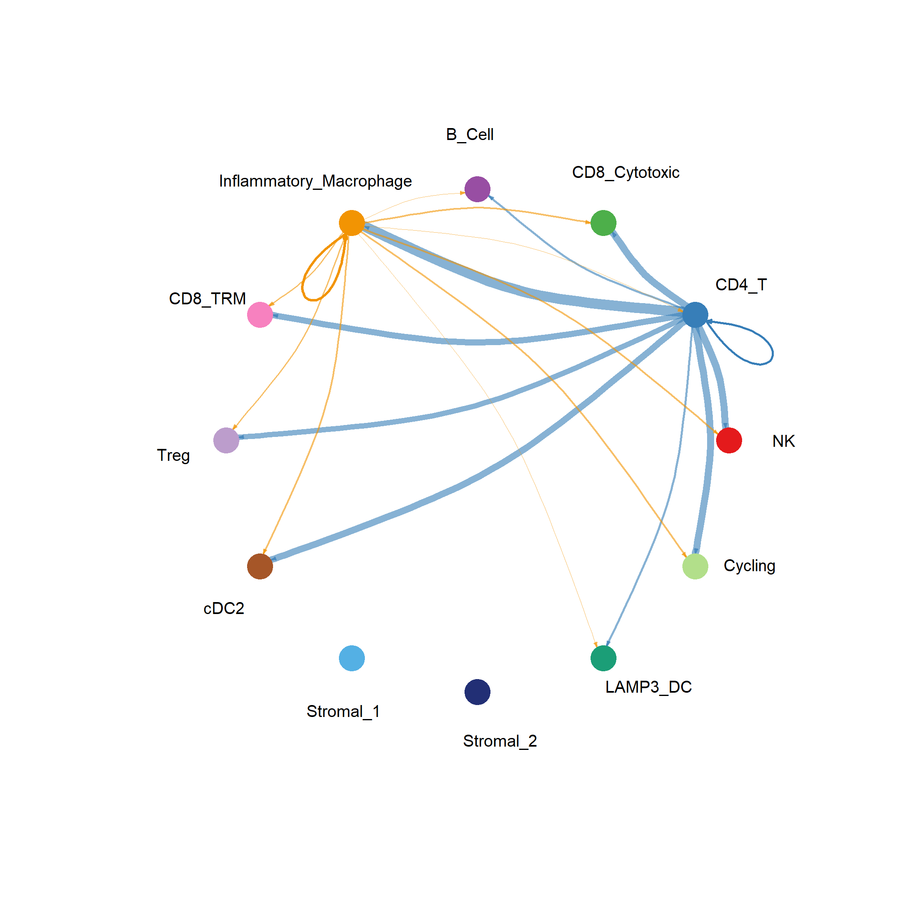
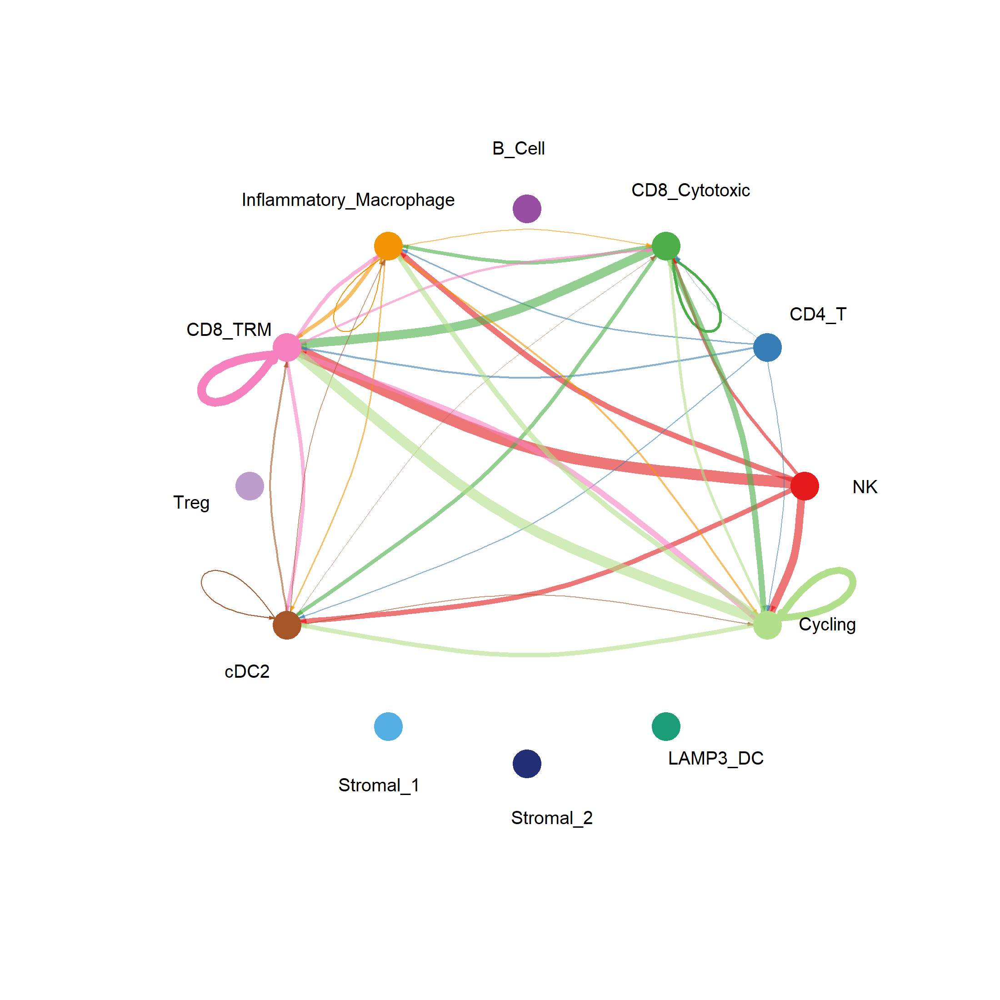

# Figures

This directory contains the principal figures generated during the cell–cell communication analysis of human lupus nephritis.

The figures were generated using **CellChat** applied to the AMP Lupus Nephritis single-cell RNA-seq dataset (SDY997), with particular emphasis on communication involving **inflammatory macrophages**.

Together, the figures progress from the global communication landscape to macrophage-centered signaling and pathway-level analysis.

---

# Figure Overview

| Figure | Description |
|--------|-------------|
| `Figure1_Global_Communication_Network.png` | Global CellChat communication network across annotated immune and stromal populations |
| `Figure2_Macrophage_Outgoing_Network.png` | Outgoing communication from inflammatory macrophages toward other cell populations |
| `Figure3_Outgoing_Signaling_Heatmap.png` | Heatmap of outgoing signaling programs across cell populations |
| `Figure4_BAFF_Network.png` | Cell–cell communication network associated with BAFF signaling |
| `Figure5_GALECTIN_Network.png` | Cell–cell communication network associated with GALECTIN signaling |
| `Figure6_TNF_Network.png` | Cell–cell communication network associated with TNF signaling |
| `Figure7_CCL_Network.png` | Cell–cell communication network associated with CCL signaling |
| `Figure8_Top_Communication_Pathways.png` | Ranking of major signaling pathways according to inferred communication strength |

---

# Figure 1 — Global Communication Network

**File:** `Figure1_Global_Communication_Network.png`

This figure summarizes the global cell–cell communication landscape inferred by CellChat across the annotated immune and stromal populations in the lupus nephritis kidney.

The network provides a systems-level view of intercellular signaling and highlights highly connected cell populations within the tissue microenvironment.

<p align="center">

</p>

### Interpretation

The global network reveals extensive communication between immune populations and supports subsequent investigation of inflammatory macrophages as prominent participants in the inferred signaling landscape.

This figure serves as the entry point for the macrophage-centered analyses presented in the following figures.

---

# Figure 2 — Inflammatory Macrophage Outgoing Communication

**File:** `Figure2_Macrophage_Outgoing_Network.png`

This figure focuses specifically on outgoing signaling inferred from inflammatory macrophages toward other immune and stromal populations.

<p align="center">

</p>

### Interpretation

Inflammatory macrophages communicate with multiple components of the renal immune microenvironment, including lymphoid, myeloid, and stromal populations.

The broad distribution of predicted outgoing interactions supports the hypothesis that inflammatory macrophages may act as important signaling hubs within the lupus nephritis microenvironment.

---

# Figure 3 — Outgoing Signaling Programs

**File:** `Figure3_Outgoing_Signaling_Heatmap.png`

This heatmap summarizes pathway-level outgoing signaling activity across the analyzed cell populations.

<p align="center">

</p>

### Interpretation

The heatmap provides a comparative view of which cell populations are predicted to contribute most strongly to specific signaling programs.

This analysis helps distinguish broadly active communication pathways from programs preferentially associated with particular cell populations, including inflammatory macrophages.

---

# Figure 4 — BAFF Signaling Network

**File:** `Figure4_BAFF_Network.png`

This figure visualizes the inferred intercellular communication network associated with **BAFF signaling**.

<p align="center">

</p>

### Interpretation

BAFF is an important regulator of B-cell survival, differentiation, and activation and represents a clinically relevant signaling pathway in systemic lupus erythematosus and lupus nephritis.

The inferred BAFF communication network provides a network-level view of the cell populations potentially contributing to or receiving BAFF-associated signaling within the analyzed kidney microenvironment.

---

# Figure 5 — GALECTIN Signaling Network

**File:** `Figure5_GALECTIN_Network.png`

This figure shows the inferred communication network associated with **GALECTIN signaling**.

<p align="center">

</p>

### Interpretation

GALECTIN signaling emerged as one of the prominent communication programs identified by the CellChat analysis.

Its broad distribution across immune populations suggests that galectin-mediated interactions may contribute to immune regulation and inflammatory network organization within lupus nephritis tissue.

The pathway represents an interesting candidate for further mechanistic investigation.

---

# Figure 6 — TNF Signaling Network

**File:** `Figure6_TNF_Network.png`

This figure visualizes the inferred cell–cell communication network associated with **TNF signaling**.

<p align="center">

</p>

### Interpretation

TNF signaling represents a major inflammatory pathway capable of influencing immune activation, cellular recruitment, and tissue responses.

The network highlights the cellular context in which TNF-associated communication is predicted to occur within the analyzed lupus nephritis samples.

---

# Figure 7 — CCL Signaling Network

**File:** `Figure7_CCL_Network.png`

This figure summarizes the inferred communication network associated with **CCL chemokine signaling**.

<p align="center">

</p>

### Interpretation

CCL chemokines regulate leukocyte trafficking and immune-cell recruitment.

The predicted CCL communication network suggests coordinated chemokine signaling between immune populations and provides a potential mechanism through which inflammatory cells may influence the composition and organization of the renal immune microenvironment.

---

# Figure 8 — Major Communication Pathways

**File:** `Figure8_Top_Communication_Pathways.png`

This figure ranks major signaling pathways according to their inferred communication strength within the CellChat analysis.

<p align="center">

</p>

### Interpretation

Prominent signaling programs identified in the analysis include:

1. MHC-II
2. MHC-I
3. GALECTIN
4. CD99
5. CLEC
6. IL16
7. PROSTAGLANDIN
8. CCL
9. ICAM
10. MIF

Together, these pathways highlight several major components of the lupus nephritis communication landscape, including:

- Antigen presentation
- Innate immune signaling
- Leukocyte recruitment
- Cell adhesion
- Immune regulation
- Inflammatory signaling

---

# Biological Story

The figures collectively describe the communication landscape from global network organization to specific signaling programs.

```text
Global Communication Landscape
              │
              ▼
Inflammatory Macrophage Communication
              │
              ▼
Cell-Specific Outgoing Signaling Programs
              │
              ▼
Pathway-Specific Networks
      ┌───────┼───────┬───────┐
      ▼       ▼       ▼       ▼
    BAFF   GALECTIN   TNF     CCL
      └───────┼───────┴───────┘
              ▼
Major Communication Pathways
```

This progression supports a systems-level interpretation of inflammatory macrophage biology by examining not only their transcriptional state, but also their predicted communication with other components of the kidney immune microenvironment.

---

# Translational Relevance

The pathway-specific figures identify communication programs with different levels of established or potential therapeutic relevance.

For example, BAFF provides an important link between the computational analysis and an established therapeutic axis in lupus, while pathways such as GALECTIN, CCL, TNF, and MIF provide additional biological hypotheses for further investigation.

These network-level results complement gene-level therapeutic target discovery by placing candidate pathways within their broader cellular context.

---

# Reproducibility

All figures in this directory are generated programmatically from the CellChat analysis.

The general workflow is:

```text
Single-Cell Dataset
        │
        ▼
CellChat Analysis
        │
        ▼
Communication Inference
        │
        ├───────────────┐
        ▼               ▼
Interaction Tables   Pathway Analysis
        │               │
        └───────┬───────┘
                ▼
        Figure Generation
```

The corresponding analysis scripts are available in:

```text
scripts/
```

and the underlying result tables are available in:

```text
results/
```

No manual modification of the analytical results is required to generate the figures.

---

# Interpretation Note

CellChat predicts potential cell–cell communication based on expression of ligands, receptors, cofactors, and known signaling relationships.

Therefore, the networks shown in these figures represent **computationally inferred communication potential** rather than direct experimental evidence of physical or functional signaling between cell populations.

Experimental and spatial validation would be required to confirm specific predicted interactions.
